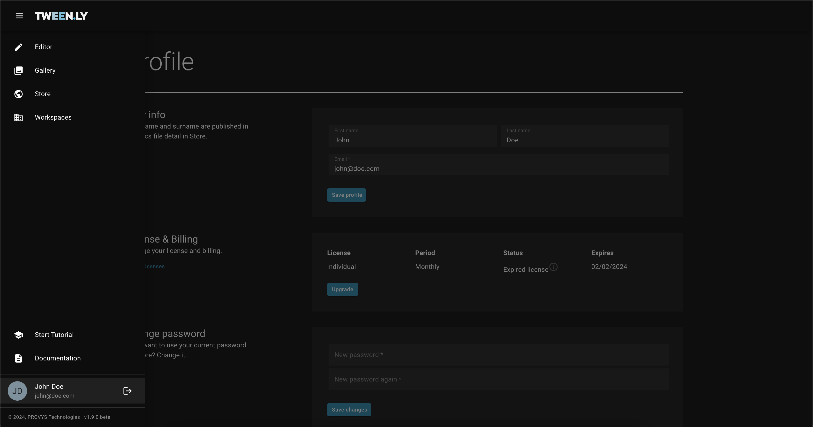

You can upgrade your Tweenly license at any time in the **Profile > License & Billing** section.

### How to Upgrade

1. Open **Profile > License & Billing**.
2. Click **Upgrade**.
3. Select your preferred license type and billing period.
4. Confirm your selection by clicking **Upgrade** again.
5. An administrator will contact you within 24 hours with payment instructions.
6. Once payment is processed, your upgraded license will be activated.

### Available License Plans

You can find all plans and pricing details <a href="https://tween.ly/#pricing" target="_blank" rel="noopener noreferrer">here</a>.

### Payments and Renewals

- Payment is manual – an administrator will provide payment details.
- If payment is not received by the due date, your license will revert to Free status.
- Your projects and workspaces will remain intact, but premium features will be disabled.
- To cancel or change your plan, contact info@tween.ly.
