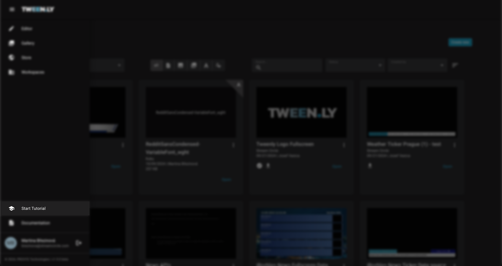
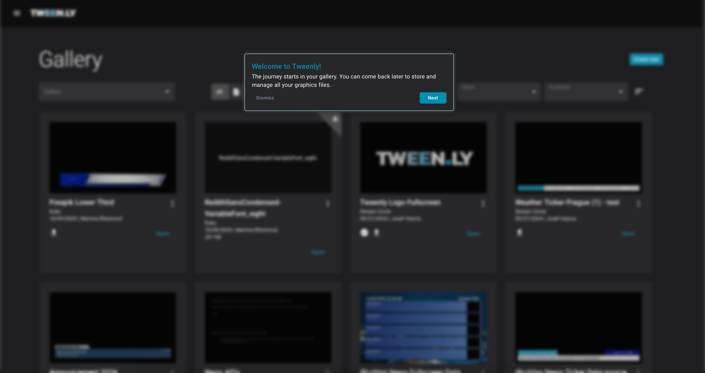

The Wizard Tutorial helps new users get started with Tweenly’s essential tools and workflow. It introduces key features such as creating a new project, navigating the editor, and saving graphics.

### Starting the Tutorial

1. Open the **main menu**.
2. Select **Tutorial**.
3. The tutorial starts in the Gallery.
4. Click **Next** to continue or **Dismiss** to exit.

:::tip
You can restart the tutorial anytime from the main menu.
:::

