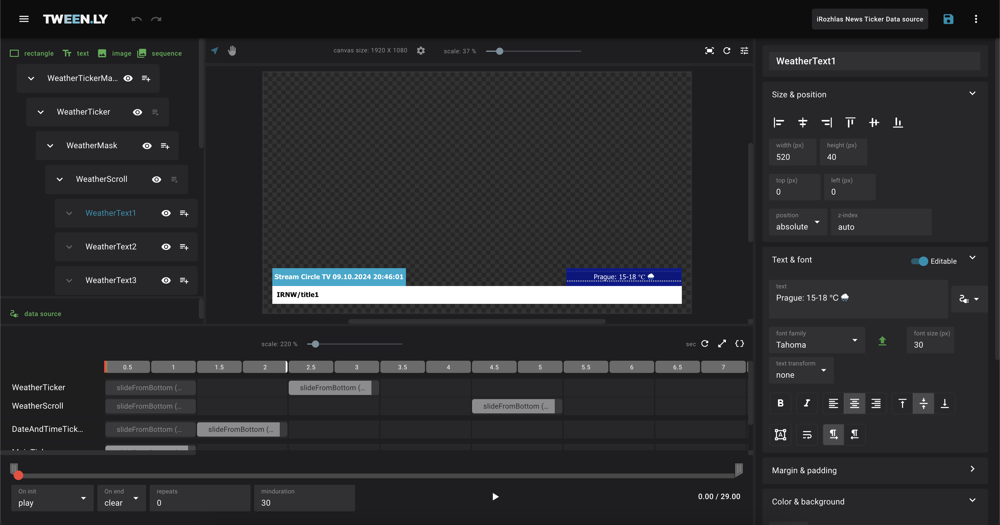
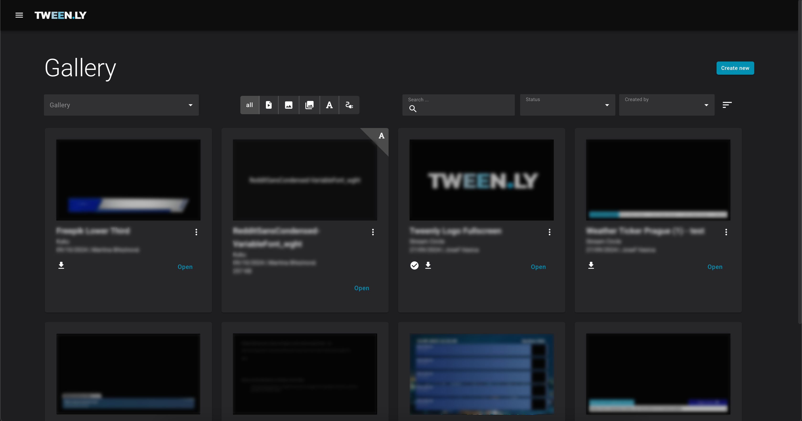
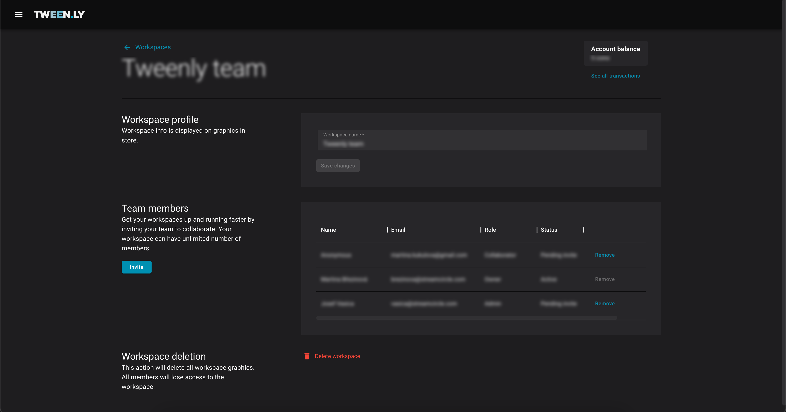
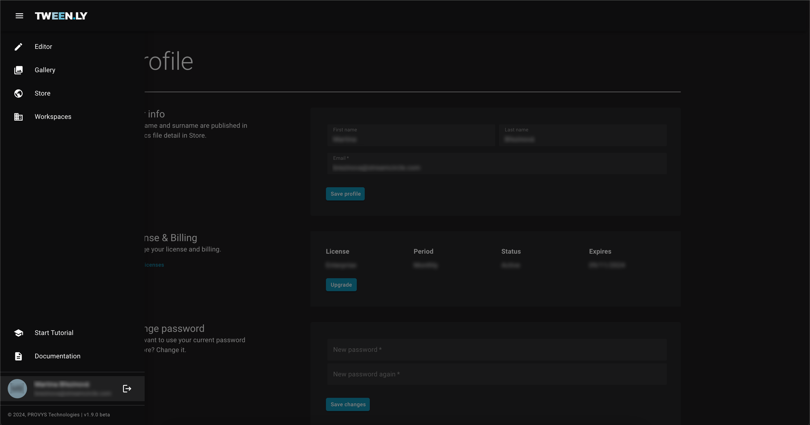

Tweenly consists of five key sections – editor, gallery, store, workspaces, and user profile.

### 1. Editor
The **Editor** is where you create, animate, and manage broadcast graphics.

- **Top bar**: Access the main menu and graphic file settings.
- **Left sidebar**: Add objects and manage the object tree.
- **Canvas**: Located in the center. This is where the graphic objects are rendered.
- **Right sidebar**: Adjust object properties, styles and animations.
- **Bottom panel**: Control animations using the timeline, and playback tools.

### 2. Gallery

The **Gallery** is your personal graphics library, where you can browse, manage, and organize graphics files and assets.

- **Filters**: Filter by workspace, type, status, or author.
- **Sorting**: Sort by title or date updated.
- **Actions**: Publish, edit details, duplicate, export, or delete files.

### 3. Store

The **Store** is a marketplace for sharing and purchasing graphics.

- **Filters**: Search by title, description, tags, or author.
- **Actions**: Unpublish files, view pricing, and purchase graphics.

### 4. Workspaces

Workspaces provide private and shared environments for managing projects.

- **Private and Own Workspaces**: Every user has a private workspace, with additional ones available based on the license type.
- **Coins and Transactions**: Earn and manage coins within your workspace through store transactions.
- **Members**: Add collaborators with different roles (Owner, Admin, Collaborator) to work on shared files.

### 5. Profile

The **Profile**  section allows you to manage personal settings, and licensing.

- Edit name, email, and password.
- Manage your license and view payment history.
- Delete your account if needed.

