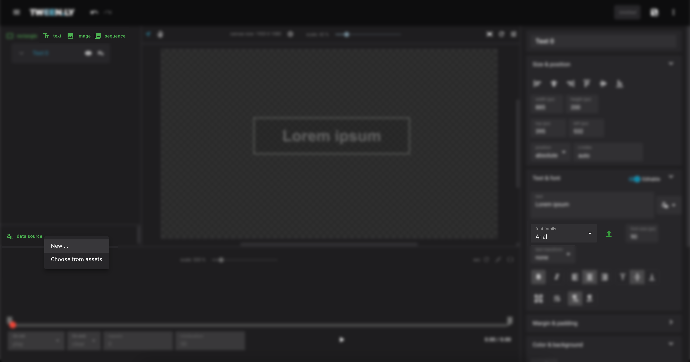
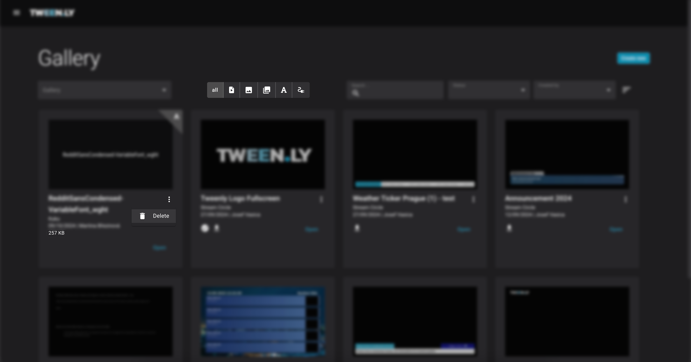
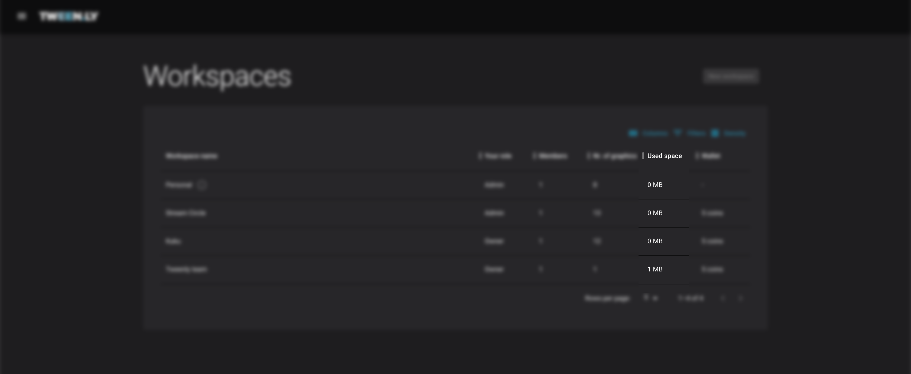

The Assets feature in Tweenly provides an efficient way **to manage and reuse essential resources across multiple graphics files within a single channel branding**. This significantly streamlines workflow by allowing users to create assets once and leverage them across different graphics without the need to duplicate resources.

## Key Benefits

- **Reusable Across Graphics**: Assets can be used in multiple graphics within the same workspace, ensuring consistency in branding and saving time.
- **Workspace-Based Management**: Assets are created within the same workspace as the graphics and can be accessed and managed centrally in that workspace.
- **Safe Deletion**: Deleting an asset does not affect the graphics where it was used. Once the asset is included in a graphic, it remains embedded even if removed from the Gallery.
- **Storage Utilization**: The new feature also provides an overview of storage utilization, helping you track how much storage assets are consuming in each workspace.

:::tip[Summary]
Assets allow you to create and centrally manage images, fonts, and data sources once, reusing them across multiple graphics in the same workspace for a streamlined workflow and consistent branding.
:::

## Asset Types

1.	**Image**: Individual images.
2.	**Image Sequence**: A series of images used for animation purposes.
3.	**Font**: Custom fonts that can be uploaded and applied to text objects.
4.	**Data Source**: External data connections that feed real-time information into your graphics.

## Create Assets in the Editor

Asset is automatically created when:

1.	**Adding a New Image or Image Sequence**: Navigate to the Editor and choose Add Image or Add Image Sequence from the left-side panel. Select **New...** and upload images or a sequence of images from the file browser.
2.	**Uploading a Font**: For text object, click **Upload Font** in the text properties panel. Upload a new font from your file browser.
3.	**Configuring a Data Source**: To create a new data source, select **New...** on Add data source from the left-side panel.

All created assets are linked to the workspace where the graphic is being designed and can be reused in any other graphic within that workspace.

## Manage Assets in the Gallery

The Gallery displays all graphics files, images, image sequences, fonts, and data sources that have been created or uploaded.

You can modify or remove assets as needed:

1.	**Editing Assets**: Select an asset from the Gallery and click Edit to modify assets name or description.
2.	**Deleting Assets**: Click on the assets more menu and choose Delete to remove it from the Gallery.

:::note
Deleting an asset does not affect the graphic using it — the graphic remains intact, but the asset will no longer appear in the gallery.
:::

## Link Assets to Your Broadcast Graphics

While editing a graphics file in Tweenly, search for a Choose from assets option. You can find it when creating new image, image sequence, or data source. Font assets are automatically listed with other system fonts.

## Monitor Asset Storage Utilization

The Gallery and Workspaces now include a feature that tracks and displays storage utilization:
- **Gallery**: The size of each asset or graphic file is also displayed directly in the Gallery.
- **Workspaces**: View the storage usage for each Workspace in the overview. 

## Best Practices for Managing Assets
- **Reusing Assets**: Take advantage of the ability to reuse assets across multiple graphics files to maintain consistency and reduce redundancy in your designs.
- **Use Descriptive Naming**: To avoid confusion, name your assets descriptively, especially when managing image sequences or multiple versions of the same asset.
- **Monitor Storage**: Regularly check the storage utilization in the Workspaces Overview to ensure that you are optimizing space and managing large files appropriately.