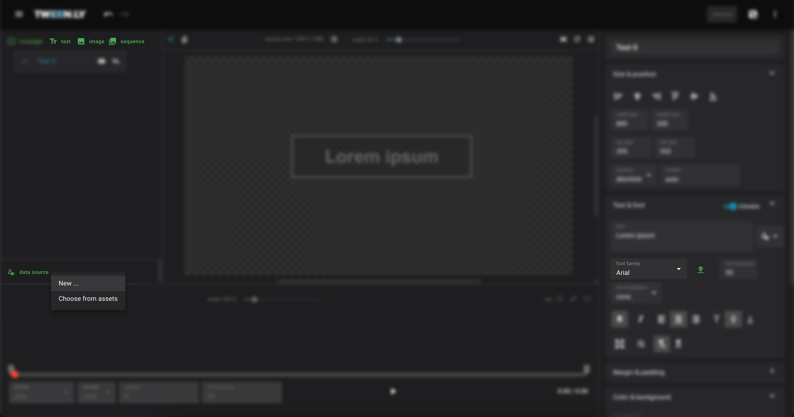
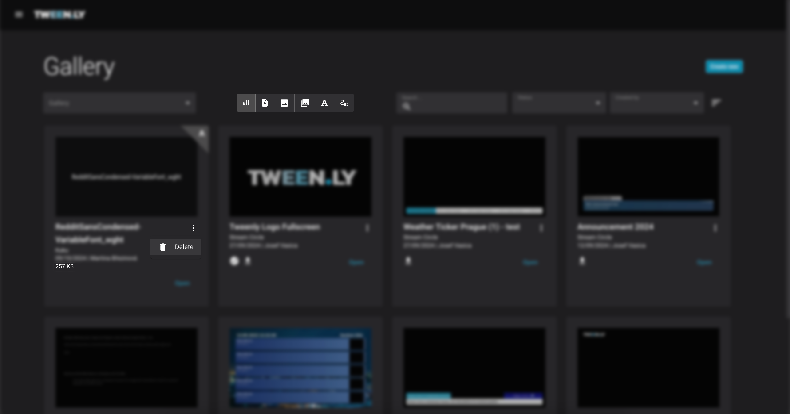

Assets in Tweenly are reusable media elements that help streamline workflow and ensure **consistent branding across multiple graphics files**. They are stored in workspaces and can be accessed by all users within a shared workspace.

## Types of Assets

- **Images** – PNG, JPG, and SVG files used in graphics.
- **Image Sequences** – Animated sequences composed of series of images.
- **Fonts** – Custom fonts for text elements.
- **Data Sources** – External data linked to graphics.

## How Assets Work

### Assets Creation

Assets are automatically created when they are added to a graphics file:

- **Adding a New Image or Image Sequence**: Select **Add Image** of **Add Image Sequence** in the Editor and upload a file(s).
- **Uploading a Font**: In text properties, click **Upload Font** and select a file(s).
- **Configuring a Data Source**: Click **Add Data Source** and create a new connection.

All assets are stored in the same workspace as the graphics file and can be used across multiple graphics within that workspace.

### Asset Behavior

- **Moving a graphics file**: Assets move with the file to the new workspace.
- **Deleting a graphics file**: Assets are not deleted and remain available for other graphics.
- **Shared workspaces**: All users in a shared workspace have access to its assets.

## Managing Assets

### Accessing Assets

1. Open the **Gallery** and navigate to the workspace where the graphics file is stored.
2. Assets in that workspace can be used in any new or existing graphics file.

### Editing and Deleting Assets

1.	**Editing Assets**: Select an asset from the Gallery and click Edit to modify assets name or description.
2.	**Deleting Assets**: Click on the assets more menu and choose Delete to remove it from the Gallery.

:::caution
Deleting an asset does not affect the graphic using it — the graphic remains intact, but the asset will no longer appear in the gallery.
:::

### Linking Assets to Graphics

When adding an image, image sequence, or data source in the Editor, select Choose from Assets to reuse existing media. Font assets automatically appear alongside system fonts.

## Monitor Asset Storage Utilization

The Gallery and Workspaces now include a feature that tracks and displays storage utilization:
- **Gallery**: The size of each asset or graphic file is also displayed directly in the Gallery.
- **Workspaces**: View the storage usage for each Workspace in the overview. 

## Best Practices
- Reuse assets instead of uploading duplicates to save space.
- Use clear naming conventions for easy asset management.
- Monitor storage usage in the Workspaces Overview to optimize space.

## TL;DR

- Assets are workspace-bound. They are stored in the same workspace as the graphics file that uses them.
- When moving a graphics file to another workspace, its assets are copied to the new workspace.
- Deleting a graphics file does not delete its assets. They remain available for other graphics files.
- In shared workspaces all workspace members can access the assets.