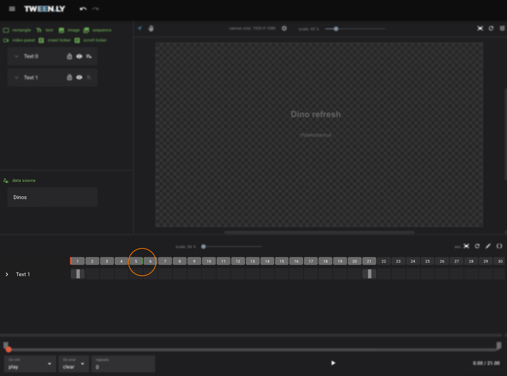

A Data Source is an asset that allows you to dynamically load external data into graphics files. Since Data Sources are workspace assets, they can be shared across multiple graphics files within the same workspace.

:::caution
If a Data Source is edited in one graphics file, the changes will automatically apply to all other graphics files using the same Data Source.
:::

## Creating a Data Source

To create a new Data Source:

- Click Data Source in the Objects Panel.
- A new data source setup window will appear.
- Complete the three-step process to define and configure the Data Source:
    - **Step 1: Data source specification** to specify the data source.
    - **Step 2: Loaded document data** to verify the loaded document data.
    - **Step 3: Data selection** to select data attributes.

### Step 1: Data source specification

Enter basic details:

- **Name** - The name of the data source.
- **Slug** - An unique identifier (short name). 🚨 The slug must be unique across all Data Sources in the workspace.
- **URL** - URL to the origin of the data source
- **type** - elect XML or JSON based on the data format.
- **Data source refresh** option - If enabled, the Data Source will refresh at the specified time (in seconds). A green label on the timeline indicates this timestamp.

Click **Next** to continue.

### Step 2: Loaded document data

- If the Data Source loads successfully, a preview will appear.
- If loading fails, an error message will indicate the issue.

Click **Next** to proceed or go Back to review Step 1.

### Step 3: Data selection

- The left column displays parsed data in a structured tree.
- Click the + button to **select attributes**.
- Selected attributes appear in the right column, where they can be:
    - Renamed (must be unique within the Data Source).
    - Reordered for easier access.
    - Removed if no longer needed.

Click **Save** to finalize the Data Source.

## Editing a Data Source

- Editing a Data Source in one graphics file affects all other graphics files using the same Data Source in the workspace.
- However, existing graphics files do not automatically update—you must manually adjust or reapply the modified attributes in each graphics file where the Data Source is used.

To edit a Data Source:
1. Open the Data Sources Panel (below the Objects Panel).
2. Left-click the Data Source to open its settings.
3. Modify the details and **Save** the changes.
4. Manually update any affected graphics files to ensure they reflect the latest data structure.

:::caution
Changes apply to all graphics files using this Data Source, but you **must manually update each file** to apply modifications correctly.
:::

## Deleting a Data Source
A Data Source can be deleted only if it is not used in any graphics file.

1. Open the Data Sources Panel.
3. Right-click the Data Source and select **Delete**.

## Using Data Source Attributes

### In Text Fields
Create a text from the Objects panel and insert an attribute into the value of the text object using a drop-down list in the right-side Objects settings panel. An attribute is inserted in the format `{slug/custom-name}`. Multiple attributes can be inserted into a text value.

1. **Create a Text** Object from the Left Sidebar (Objects Panel).
2. Navigate to the **Right Sidebar (Properties Panel) > Text & Font section**.
3. Use the **drop-down list to insert an attribute** into the text value in the format: `{slug/custom-name}`.

:::tip
Multiple attributes can be inserted into the same text field. It can also be combined with other text.
:::

### In Images

Create a new image from the Objects panel. Choose the Insert image URL option. Enter the URL or select an attribute from the drop-down list. Confirm with the Create button. To edit the image source, select the image and click Replace image in the Image section of the right-side panel.

1. **Create a New Image** from the Left Sidebar (Objects Panel).
2. Choose **Insert URL**.
3. Enter a static URL or select a Data Source attribute from the drop-down list.
4. Click **Create** to confirm.

To **change the image source**:
1. Select the image.
2. Navigate to the **Right Sidebar (Properties Panel) > Image section**.
3. Click **Replace image**.

