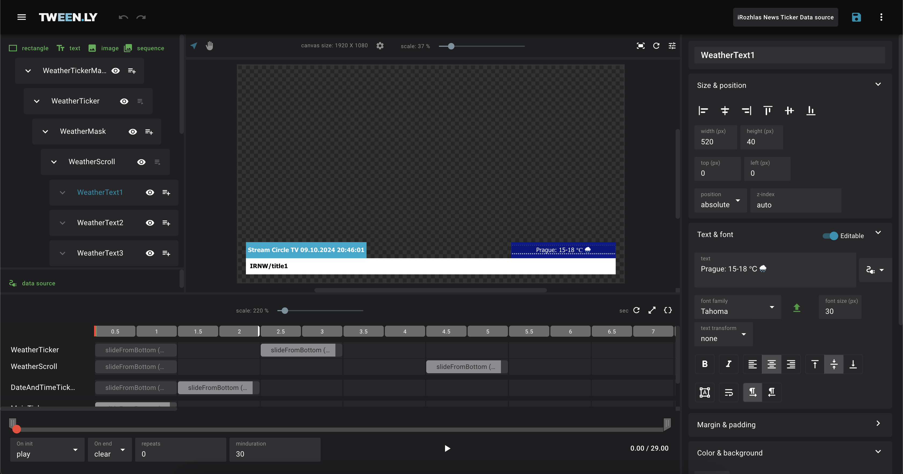

The **Editor** is the core of Tweenly, where you create, edit, and animate broadcast graphics. This page provides an overview of the **interface, layout, and essential tools** used to design and manage graphic files.

## Editor Layout

The Editor consists of five key sections:  

1. **Top Bar** – File actions, main menu, and project settings.  
2. **Left Sidebar** – Tools for adding objects and managing object hierarchy.  
3. **Canvas** – The main workspace for arranging and animating objects.  
4. **Right Sidebar** – Controls for object properties and animations.  
5. **Bottom Panel (Timeline)** – Manages animation timing and playback.  

  

---

## 1. Top Bar (File Management)

The **Top Bar** provides quick access to essential file actions.  

- **Main Menu** – Navigation for Gallery, Profile, and project creation.  
- **File Actions**:  
  - **Save** – Manually save your work.  
  - **More** – Access **New, Duplicate, Export and Clear** actions.  

<!-- 👉 For more details on **file management**, see [Graphics File](#).   -->

---

## 2. Left Sidebar (Object Management)

The **Left Sidebar** allows you to add objects and manage their hierarchy.  

### Adding Objects
Tweenly supports three primary object types:  
- **Rectangle** – For backgrounds, masks, or layout elements.  
- **Text** – Supports both system and uploaded fonts.  
- **Image** – Accepts `png, jpg, bmp, gif` formats.  
- **Image sequences**
- **Video panel**

### Object Tree
- Objects **reordered** (move up, down, to the root), or **nested** (e.g., text inside a rectangle).  
- **Right-click** an object to duplicate, delete, or create child objects.  
- **Nesting is limited**:  
  - ✅ **Rectangles & Images**: Can contain child objects.  
  - ❌ **Text, Image sequences and Video panel Objects**: Cannot have children.  

<!-- ## **Working with Objects**  

### **Rectangle**  
- Used for backgrounds, masks, and layout structures.  
- Supports gradients, opacity, and overflow controls.  

### **Image**  
- Supports `bmp, jpeg, png, gif` formats.  
- Can contain child objects.  

### **Text**  
- Supports **predefined system fonts** and **custom fonts**.  
- **Text Sizing Options**:  
  - **Fixed** → The font size remains constant.  
  - **Fitting** → The text resizes dynamically to fit its bounding box.  

### **Common Object Actions**  
- **Duplicate** – Right-click in the Object Tree or Canvas.  
- **Delete** – Right-click and select **Delete**.   -->

<!-- 👉 Learn more about **object hierarchy and structuring** in [Working with Objects](#).   -->

## 3. Canvas (Main Workspace)

The **Canvas** is where you visually arrange and modify graphics.  

- **Zoom & Pan**: Adjust your view to focus on specific areas.
- **Manipulate Objects**: Move, resize, and rotate objects.
- **Selection & Grouping**: Select multiple objects for bulk actions.

## 4. Right Sidebar (Object Properties & Animations)

The **Right Sidebar** provides tools for modifying objects and animations.  

### Object Properties

Each object in the scene has configurable properties, including:

- **Position**: X/Y coordinates.
- **Size**: Width and height.
- **Color**: For rectangles and text.
- **Borders and Gradients**: For rectangles.
- **Overflow**: Manage text overflow or masking.

### Animations

The **Animations tab** lets you add and customize animations for the selected object. Adjust animation types, duration, and easing (e.g., fade, move, scale).

<!-- 👉 For advanced animation techniques, see [Animation Tools](#).   -->

## 5. Bottom Panel (Timeline & Animation Control)

The **Timeline** controls animation playback and timing.  

- **Keyframes** – Define specific points in time when an object changes (e.g., moves or fades).  
- **Playhead** – Drag the playhead to preview different points in the timeline.  
- **Duration & Timing** – Adjust the start time, end time, and duration of animations by dragging objects on the timeline.  

### Animation Controls
- **Add Keyframes** – Click the **Add Keyframe** button.  
- **Playback Controls** – Play, pause, and review animations.  

<!-- 👉 Learn how to **refine animations** in [Animation Tools](#).   -->

<!--

---

### Advanced Features

For more complex graphics, the Tweenly Editor offers several powerful features:

- **Custom Keyframes**: Create intricate animations using keyframe controls.
- **Groups and Layers**: Manage multiple objects together by grouping or layering them.
- **HTML & JS Export**: Export your graphics as HTML and JavaScript for broadcast integration. -->

<!-- 👉 See [Advanced Editor Tools](#) for details.  -->
