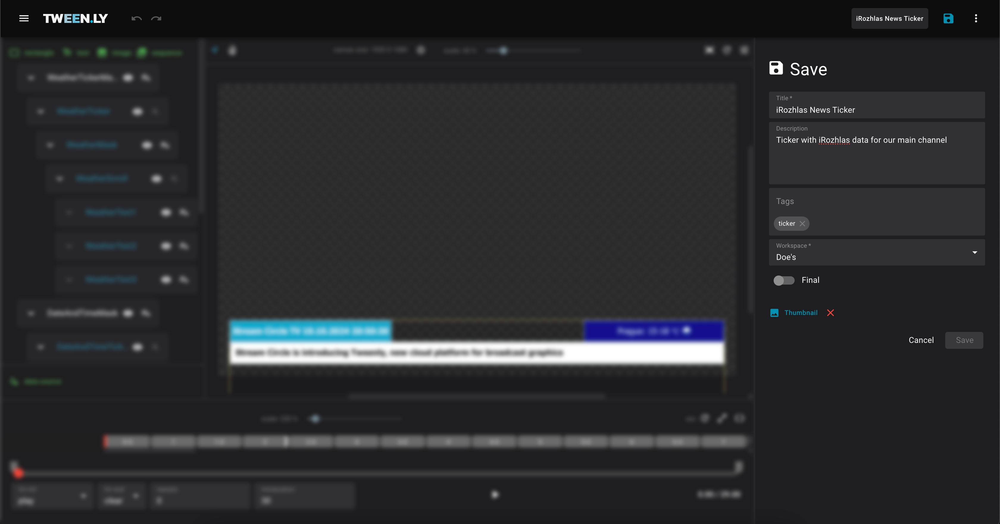
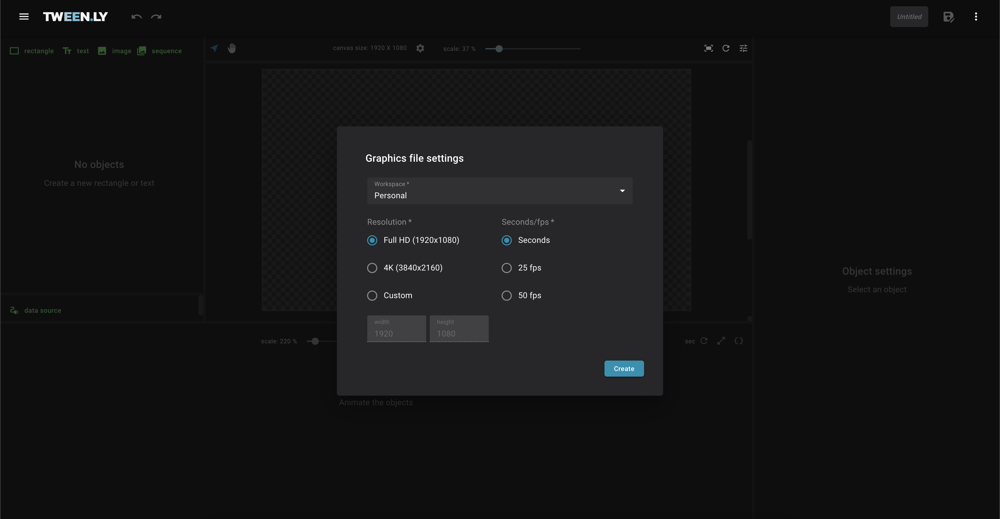
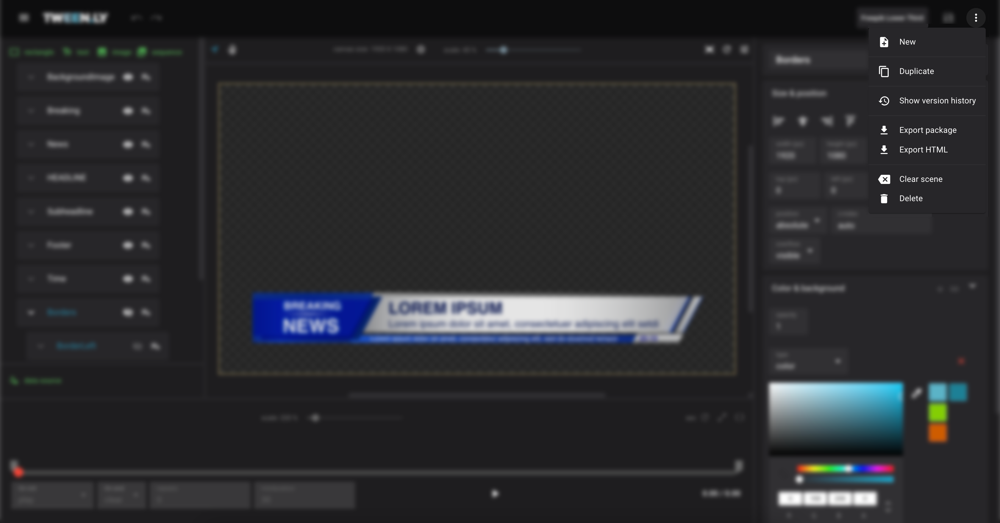

Each graphics file consist of:

- The **graphic scene**: The visual representation of your design.
- **Metadata**: File information such as title, description, and tags.

### Metadata Fields

- **Title**: The name of the file.
- **Description**: A short summary visible in the Editor, Gallery, and Store.
- **Tags**: Keywords used for searching.
- **Workspace**: The file’s storage location.
- **Final Flag**: "Locks" the file to prevent further edits. To modify, duplicate or unlock it.
- **Thumbnail**: A preview image in the Gallery and Store.

## Creating & Managing Graphics Files

### Creating a New File

1. Open the **More** menu in the top bar.
2. Select **New** to clear the canvas and start a new file.

### Saving a Graphics File

:::caution
**Tweenly does not auto-save**. Always save manually.
:::

#### First-Time Save

1. Ensure the scene contains at least one object.
2. Click the **Save** in the top bar.
3. Enter Title, Description, Tags, and Workspace.
4. Click **Save**. The file is now stored in the Gallery.

#### Quick Save

- Click **Save** icon in the top bar anytime to save changes without modifying metadata.

#### Updating Metadata

1. Click on the filename to open the metadata form.
2. Edit the title, description, or tags.
3. Click **Save** to update.

### Duplicating a Graphics File

Duplicated files retain all objects, animations, and settings.

1. Open the **More** menu in the top bar.
2. Click **Duplicate**.
3. Update metadata if needed.
4. Click **Duplicate** to create a new file.

## Clearing vs. Deleting a File

### Clearing the Scene

- Removes all objects from the canvas but keeps metadata.
- Use when you want a fresh start without losing file info.
- To clear the scene, open the **More** menu and click **Clear**.

### Deleting a Graphics File

Deleted files cannot be recovered. If the file was published in the Store, it will no longer be available for purchase.

1. Open the **More** menu.
2. Click **Delete** to remove the file permanently.

